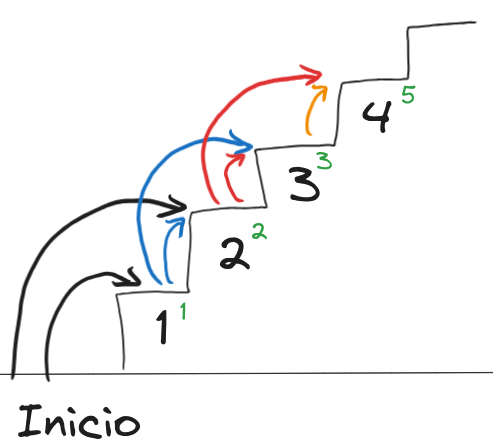

# 7. La escalera (apple, adobe)

Estás escalando una escalera que tiene `n` pasos.
Puedes avansar `1` o `2` pasos cada vez.
Calcula de cuantas maneras distintas puedes llegar a la cima de la escalera.



## Example 1:

```bash
Input: n = 1
Output: 1
```

## Example 2:

```bash
Input: n = 2
Output: 2
```

## Example 3:

```bash
Input: n = 17
Output: 2584
```

## Constraints:

- `1 <= n <= 50`
