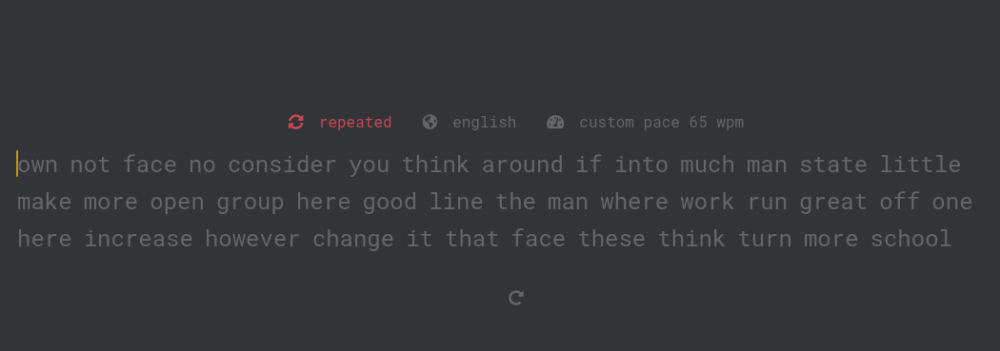

# 8. monkeytype clone

## Requerimientos

- Clone de [moneytype](https://monkeytype.com/)
- Agregar el tiempo
- Cuando se empieze a escribir el tiempo debe empezar a correr
- Se genere un texto aleatorio inicial
- Que permita escribir el texto similar al monkeytype
- Al finalizar el tiempo, debe mostrarse los resultados (wpm, acc)
- Permita reiniciar

## Tecnologías

- HTML
- CSS
- JavaScript

## Restricciones

- Todo el código debe estar en un fichero index.html
- Pueden ver el video pero no lo hagan igual 😜
- No se puede utilizar ninguna tecnología extra a las mensionadas

## Ayuda

- [Fórmulas para calcular wpm y acc](https://typingcom.helpscoutdocs.com/article/205-how-wpm-words-per-minute-and-accuracy-are-calculated-teacher-student#:~:text=A%20%22word%22%20is%20equivalent%20to,%2F%202%20min%20%3D%2030%20WPM.)
- [video de midudev](https://www.youtube.com/watch?v=157qVlTelOg)

